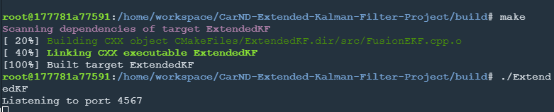
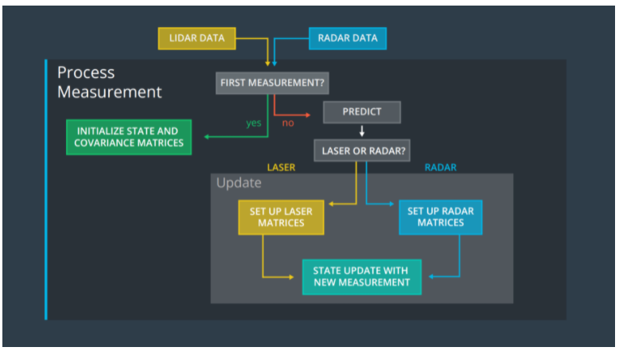
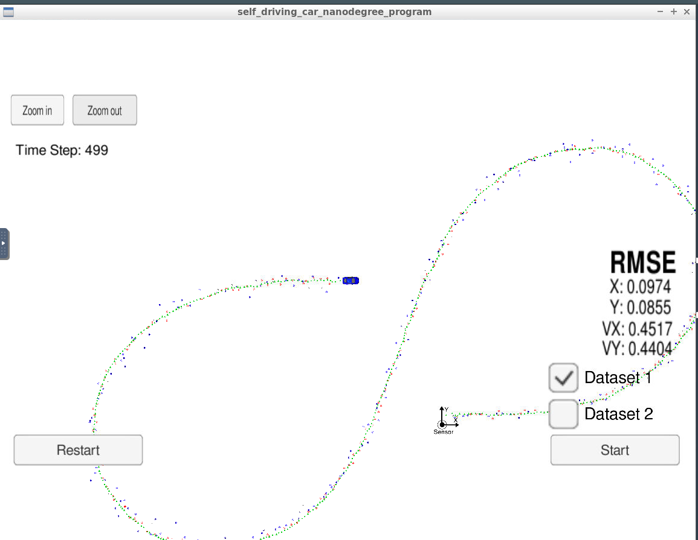
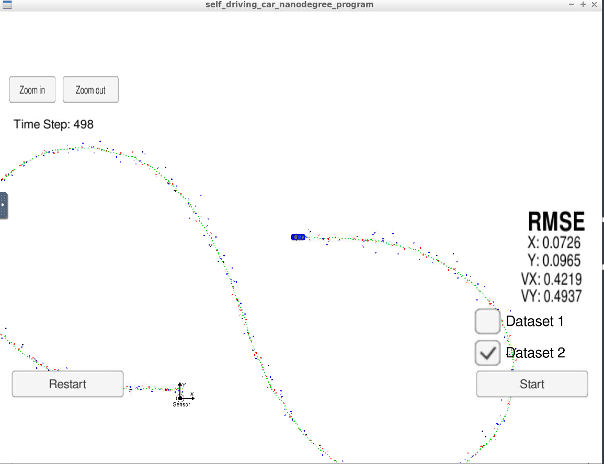

# Extended Kalman Filter Project Starter Code
Self-Driving Car Engineer Nanodegree Program

In this project you will utilize a kalman filter to estimate the state of a moving object of interest with noisy lidar and radar measurements. Passing the project requires obtaining RMSE values that are lower than the tolerance outlined in the project rubric.

This project involves the Term 2 Simulator which can be downloaded [here](https://github.com/udacity/self-driving-car-sim/releases)

This repository includes two files that can be used to set up and install [uWebSocketIO](https://github.com/uWebSockets/uWebSockets) for either Linux or Mac systems. For windows you can use either Docker, VMware, or even [Windows 10 Bash on Ubuntu](https://www.howtogeek.com/249966/how-to-install-and-use-the-linux-bash-shell-on-windows-10/) to install uWebSocketIO. Please see the uWebSocketIO Starter Guide page in the classroom within the EKF Project lesson for the required version and installation scripts.

## How to handle

Sequential enter the folloing command

1. mkdir build
2. cd build
3. cmake ..
4. make
5. ./ExtendedKF


If it show "port 4567", you are success.


## Basic Principles

1.Gaussian function
2.Bayes' theorem
***python***
```
Gaussian
from math import *
# Gaussian
def f(mu, sigma2, x):
    return 1/sqrt(2.*pi*sigma2) * exp(-.5*(x-mu)**2 / sigma2)

# measurements update
def update(mean1, var1, mean2, var2):
new_mean =(1/(var1+var2))*(var2*mean1+var1*mean2)
new_var =1/((1/var1)+(1/var2))
return [new_mean, new_var]
```


Overview of the Kalman Filter Algorithm Map




## The Code

I basically follow the course way to finish my project.
put the kalman filter to achieve the goal of prediction.

There are four files you can edit.

-`main.cpp`
-`Fusion EKF.cpp`
-`kalman_filter.cpp`
-`tools.cpp`

main.cpp, kalman_filter.cpp and tools.cpp are easier to finish.
I spend a lot of time on Fusion EKF.cpp file.

## The Results
Here is the simulator final state after running the EKL with dataset 1:

Here is the simulator final state after running the EKL with dataset 2:

